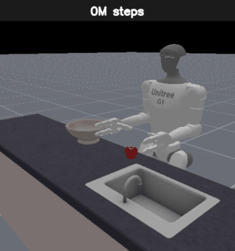

# Unitree G1 — Reinforcement Learning

Reinforcement-learning experiments on the [Unitree G1](https://www.unitree.com/g1)
humanoid robot. The repository collects two self-contained projects that tackle
two very different control problems with PPO:

| Project | Skill | Simulator | RL stack | Hardware |
|---------|-------|-----------|----------|----------|
| [`locomotion/`](locomotion) | Walk forward without falling | [MuJoCo](https://mujoco.org/) | [Stable-Baselines3](https://stable-baselines3.readthedocs.io/) PPO | CPU or GPU |
| [`manipulation/`](manipulation) | Pick an apple and place it in a bowl | [ManiSkill 3](https://maniskill.readthedocs.io/) | Custom GPU PPO (CleanRL-style) | NVIDIA GPU required |

Both use Proximal Policy Optimization but sit at opposite ends of the spectrum:
the locomotion task is a classic whole-body balance/gait problem trained with
CPU-vectorized envs, while the manipulation task is a high-DOF dexterous problem
trained with thousands of GPU-parallel environments and heavily shaped rewards.


## Demos — training progression

**Locomotion** (MuJoCo) — checkpoints from 20k → 10M steps, played in sequence.
Early policies topple over; later ones learn to keep their balance and hold a
stable upright stance.


**Manipulation** (ManiSkill 3) — checkpoints from untrained → ~99M steps. The
policy learns to reach the apple (~5M), grasp it (~10M), and finally place it in
the bowl (~26M).



Full captions and full-resolution clips are in each project's README
([locomotion](locomotion/README.md) · [manipulation](manipulation/README.md)).

## Repository layout

```
Unitree-G1-RL/
├── locomotion/        # MuJoCo + SB3 — teach the G1 to walk
│   ├── env.py             # custom Gymnasium environment (G1Env)
│   ├── train.py           # PPO training entry point
│   ├── evaluate.py        # render a trained policy
│   ├── view_robot.py      # sanity-check the env with zero actions
│   ├── pretrained/        # small demo policy (committed) so evaluate runs out of the box
│   └── requirements.txt
├── manipulation/      # ManiSkill 3 + GPU PPO — place an apple in a bowl
│   ├── train.py           # full 100M-step training run
│   ├── smoke_train.py     # quick end-to-end smoke run
│   ├── custom_reward.py   # staged reward shaping for the place task
│   ├── evaluate.py        # render the latest checkpoint
│   ├── reference/         # unmodified ManiSkill PPO baseline, for comparison
│   ├── tools/             # small env-introspection / literature helpers
│   ├── tests/             # exploratory sanity scripts
│   └── requirements.txt
├── LICENSE            # Apache-2.0
└── .gitignore
```

> **Not in git (by design).** Vendored robot models (`mujoco_menagerie/`),
> training checkpoints (`models/`, `runs/`) and tensorboard logs (`logs/`) are
> large and are excluded via `.gitignore`. The committed `locomotion/pretrained/`
> policy is the exception so you can see a result immediately.

## Getting started

Each project is independent and has its own `requirements.txt` and README with
full instructions. In short:

```bash
# Locomotion (CPU is fine)
cd locomotion
python -m venv .venv && source .venv/bin/activate     # Windows: .venv\Scripts\activate
pip install -r requirements.txt
git clone https://github.com/google-deepmind/mujoco_menagerie   # robot model assets
python evaluate.py        # watch the shipped pretrained policy walk
```

```bash
# Manipulation (NVIDIA GPU required)
cd manipulation
pip install -r requirements.txt        # see https://maniskill.readthedocs.io/ for ManiSkill 3
python smoke_train.py     # quick end-to-end check, then `python train.py` for the real run
```

See **[locomotion/README.md](locomotion/README.md)** and
**[manipulation/README.md](manipulation/README.md)** for task details, reward
design, hyperparameters, and how to monitor training in TensorBoard.

## Acknowledgements

- **Robot model:** [Unitree](https://www.unitree.com/) G1, via the MuJoCo
  [`mujoco_menagerie`](https://github.com/google-deepmind/mujoco_menagerie).
- **Manipulation environment & PPO baseline:**
  [ManiSkill 3](https://github.com/haosulab/ManiSkill) and its
  [CleanRL](https://github.com/vwxyzjn/cleanrl)-derived PPO example.
- **Locomotion RL:** [Stable-Baselines3](https://github.com/DLR-RM/stable-baselines3).

The manipulation trainer is adapted from ManiSkill's official PPO baseline; the
unmodified reference is kept in [`manipulation/reference/`](manipulation/reference)
for transparency.

## License

Released under the [Apache License 2.0](LICENSE).
