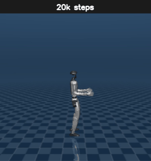

# G1 Locomotion — Learning to Walk (MuJoCo + PPO)

Train the Unitree G1 humanoid to walk forward in [MuJoCo](https://mujoco.org/)
using [Stable-Baselines3](https://stable-baselines3.readthedocs.io/) PPO. The
environment is a standard Gymnasium `Env` with a hand-tuned reward that rewards
forward velocity while keeping the robot upright, balanced, and smooth.

A small pretrained policy ships in [`pretrained/`](pretrained) so you can watch a
result without training anything.

## Training progression



The same policy at nine checkpoints from 20k to 10M steps, played in sequence.
Early checkpoints flail and topple over; by ~5–6M steps the G1 has learned to
keep its balance and hold a stable upright stance. (Forward travel stays small —
the upright and posture reward terms dominate, so the policy converges to
*balancing* rather than striding out.) Full-resolution clip:
[training_progression.mp4](media/training_progression.mp4).

## The environment (`env.py`)

`G1Env` wraps `mujoco_menagerie/unitree_g1/scene.xml`.

- **Control rate:** physics `timestep = 0.002 s` with `frame_skip = 10`, i.e. the
  policy acts at **50 Hz** (`dt = 0.02 s`).
- **Action space:** `Box(-1, 1)` of length `model.nu` (one per actuator). Actions
  are rescaled into each actuator's control range before stepping.
- **Observation space:** `qpos[2:]` (joint state minus the root x/y, for
  translation invariance) concatenated with the full `qvel`.

### Reward

Each step the reward is the sum of these terms (see `step()` in `env.py`):

| Term | Sign | Purpose |
|------|------|---------|
| `1.0 · v_x` | + | forward (x-axis) velocity — the main objective |
| healthy bonus (`+1`) | + | awarded while the robot stays upright (see below) |
| `1.0 · torso_z` | + | "head held high" — encourages an upright torso |
| `0.1 · Σ aᵢ²` | − | control cost (penalize large actuation) |
| `3.0 · (qx² + qy²)` | − | upright penalty on body roll/pitch (quaternion) |
| `0.5 · Σ (aₜ − aₜ₋₁)²` | − | action-rate penalty for smoother motion |
| `0.001 · Σ q̇ⱼ²` | − | joint-velocity penalty |

**Healthy / termination:** the episode terminates when the robot is no longer
"healthy" — pelvis height outside `(0.4, 1.2) m`, torso below `0.5 m`, or either
hand below `0.2 m` (i.e. it fell, folded over, or put a hand on the ground).
A `TimeLimit` truncates episodes at 10,000 steps.

## Setup

```bash
cd locomotion
python -m venv .venv && source .venv/bin/activate     # Windows: .venv\Scripts\activate
pip install -r requirements.txt

# Robot model assets (not committed). This must live at locomotion/mujoco_menagerie/.
git clone https://github.com/google-deepmind/mujoco_menagerie
```

All scripts use paths relative to this folder, so run them from `locomotion/`.

## Usage

```bash
# Watch the shipped pretrained policy
python evaluate.py

# Sanity-check the environment (applies zero actions and renders)
python view_robot.py

# Train from scratch (10M timesteps, 8 parallel envs)
python train.py
```

Training writes:
- intermediate checkpoints to `models/` (every 10k steps),
- the final policy + observation normalizer to `pretrained/`
  (`g1_ppo_final.zip`, `vec_normalize.pkl`),
- TensorBoard logs to `logs/`.

Monitor progress with:

```bash
tensorboard --logdir logs
```

Custom scalars (`custom/reward_forward`, `custom/reward_survive`,
`custom/z_pos`, …) are logged via `TensorboardCallback` in `train.py`.

## Hyperparameters

PPO (`MlpPolicy`) defaults from `train.py`, chosen for continuous control:

| Param | Value |
|-------|-------|
| parallel envs | 8 (`SubprocVecEnv`) |
| total timesteps | 1e7 |
| learning rate | 3e-4 |
| n_steps / batch_size | 2048 / 64 |
| n_epochs | 10 |
| gamma / gae_lambda | 0.99 / 0.95 |
| clip_range | 0.2 |
| ent_coef | 0.0 |
| obs/reward normalization | `VecNormalize` (clip_obs=10) |

`device="auto"` selects CUDA when available and falls back to CPU.

## Files

| File | Purpose |
|------|---------|
| `env.py` | `G1Env` Gymnasium environment and reward |
| `train.py` | PPO training loop, callbacks, checkpointing |
| `evaluate.py` | load a policy + normalizer and render it |
| `view_robot.py` | open the viewer and step with zero actions |
| `pretrained/` | committed demo policy and normalizer |
